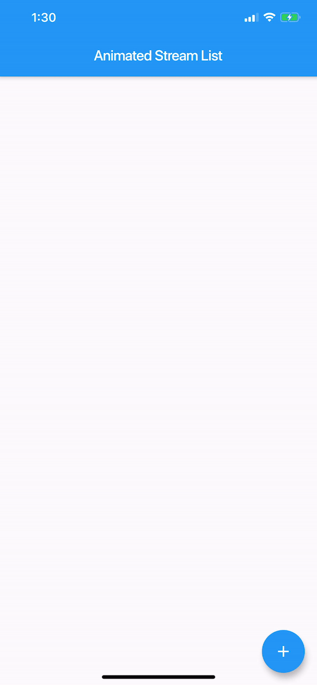

# Animated Stream List    

[](https://pub.dartlang.org/packages/animated_stream_list) [](https://travis-ci.com/adithyaxx/animated-stream-list)

 A Flutter library to easily display a list with animated changes from a ```Stream<List<E>>```.    
It's like ```StreamBuilder + ListView.Builder``` with animations.    
Taken inspiration from the [Animated List Sample](https://flutter.dev/docs/catalog/samples/animated-list) and [Java-diff-utils](https://github.com/KengoTODA/java-diff-utils) 


 
## Getting Started

#### 1. Add dependency to your  `pubspec.yaml`

```yaml
dependencies:
  animated_stream_list: ^1.1.0
```
#### 2. Import it

```dart
import 'package:animated_stream_list/animated_stream_list.dart';
```

#### 3. Use it. See the examples folder for an ... example.
  
## Parameters
   
```dart 
@required Stream<List<E>> streamList;
@required AnimatedStreamListItemBuilder<E> itemBuilder; 
@required AnimatedStreamListItemBuilder<E> itemRemovedBuilder; 
Duration duration;
```   

`AnimatedStreamListItemBuilder<T>` is just a function which builds a tile    
  
```dart 
typedef Widget AnimatedStreamListItemBuilder<T>(
  T item,
  int index,
  BuildContext context,
  Animation<double> animation,
); 
```   

## Example

```dart
// create tile view as the user is going to see it, attach any onClick callbacks etc. 
Widget _createTile(String item, Animation<double> animation) {    
 return SizeTransition(      
    axis: Axis.vertical,      
    sizeFactor: animation,      
    child: const Text(item),    
  ); 
}

// what is going to be shown as the tile is being removed, usually same as above but without any 
// onClick callbacks as, most likely, you don't want the user to interact with a removed view 
Widget _createRemovedTile(String item, Animation<double> animation) {    
 return SizeTransition(      
    axis: Axis.vertical,      
    sizeFactor: animation,      
    child: const Text(item),    
  ); 
}

final Stream<List<String>> list = // get list from some source, like BLOC  
final animatedView = AnimatedStreamList<String>(      
  streamList: list,      
  itemBuilder: (String item, int index, BuildContext context, Animation<double> animation) =>      
    _createTile(item, animation),      
  itemRemovedBuilder: (String item, int index, BuildContext context, Animation<double> animation) =>  
    _createRemovedTile(item, animation), 
  ); 
} 
 ```

## Options  

```dart
List<E> initialList;
```
Initial list
  
```dart 
Equalizer equals; 
```   

Compares items for equality, by default it uses the `==` operator, it's **critical** this works properly.    
    
`Equalizer` is function, that, given two items of the same type, returns true if they are equal, false otherwise  
    
```dart 
typedef bool Equalizer(dynamic item1, dynamic item2); 
```    

 You can check the [Animated List Documentation](https://docs.flutter.io/flutter/widgets/AnimatedList-class.html) for the rest:    
  
```dart 
Axis scrollDirection;
bool reverse;
ScrollController scrollController;
bool primary;
ScrollPhysics scrollPhysics;
bool shrinkWrap;
EdgeInsetsGeometry padding;
```

## Credits
This amazing package was originally created by [Dawid Bota](https://gitlab.com/otsoaUnLoco) over [here](https://gitlab.com/otsoaUnLoco/animated-stream-list). I have taken over the development with his blessing and all tracking will be done on this repo moving forward.
